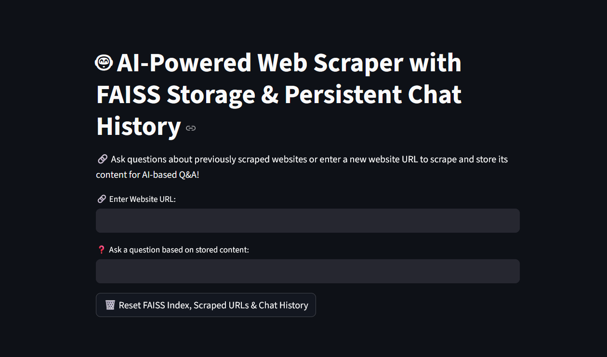

# 🧠 AI-Powered RAG Chatbot for Website Knowledge Base

A domain-specific AI chatbot that answers questions about a website using **Retrieval-Augmented Generation (RAG)**, **FAISS**, and **Ollama's Mistral LLM**. It scrapes website content, stores it in a vector database, and provides context-aware responses via a **Streamlit** UI.

> 📌 **Key Use Case**: Build a private chatbot that deeply understands your website and provides reliable, context-aware responses.

---

## 🚀 Features
- 🔍 Web scraping with `requests` and `BeautifulSoup`
- 📚 Text chunking and FAISS vector storage
- 💬 Mistral LLM for natural language responses
- 🧩 RAG architecture for accurate answers
- 🧪 Interactive Streamlit interface
- 🔒 Persistent chat history and scraped URLs

## 📸 Demo




---

## ⚙️ Tech Stack
| Component | Tech Used |
|-----------|-----------|
| Frontend | Streamlit |
| LLM | Mistral via Ollama |
| Embeddings | HuggingFace |
| Vector DB | FAISS |
| Web Scraping | `requests`, `BeautifulSoup` |

---

## 📈 How It Works
1. Scrape website content from a provided URL.
2. Chunk and embed text into FAISS for fast retrieval.
3. Answer user questions using RAG (retrieve relevant chunks, generate responses with Mistral).
4. Display results in a Streamlit UI with chat history.

**Example**:
Let’s say you want to create a chatbot for your company’s product documentation site. You run this app with your URL:

```

[https://your-website.com/docs/](https://your-website.com/docs/)

````

Then your customers can ask questions like:

- "How do I reset my password?"
- "What are the system requirements for installation?"

The chatbot searches your site content and provides accurate, AI-generated answers — all while keeping data private.

---

## 📂 Project Structure
```
📁 ai_web_scraper_chatbot/
├── ai_web_scraper_faiss.py  # Main logic (scraping, embedding, chat flow)
├── requirements.txt         # Python dependencies
├── README.md                # Project documentation
├── LICENSE                  # Proprietary license
```

---

## 🖥️ Setup Instructions

### 1. Clone the Repository
```bash
git clone https://github.com/Adamderbel/rag-chatbot.git
cd ai_web_scraper_chatbot
```

### 2. Install Dependencies
```bash
python -m venv venv
source venv/bin/activate  # On Windows: venv\Scripts\activate
pip install -r requirements.txt
```

### 3. Set Up Ollama
1. Install [Ollama](https://ollama.com/download) (supports Linux, macOS, Windows).
2. Start the Ollama server:
   ```bash
   ollama serve
   ```
3. Pull and run the Mistral model (or any Ollama-supported model):
   ```bash
   ollama pull mistral
   ollama run mistral
   ```

### 5. Run the App
```bash
streamlit run ai_web_scraper_faiss.py
```

---

## 💻 System Requirements
- Python 3.8+
- 4GB+ RAM (8GB recommended for FAISS and Ollama)
- Ollama server (Linux, macOS, or Windows)
- Internet connection for scraping and model downloads

## 🧪 Testing
1. Run the app and enter `https://example.com`.
2. Ask "What is this website about?" and verify the response.

## 🛠️ Troubleshooting
- **Ollama not running**: Start with `ollama serve`.
- **FAISS error**: Delete `faiss_index` folder and re-scrape.
- **Model not found**: Run `ollama pull mistral`.
- **Memory issues**: Use `faiss-gpu` or limit scraped content for large websites.

## ⚠️ Security Note
FAISS uses `allow_dangerous_deserialization=True`. Only use trusted index files to avoid security risks.

---


